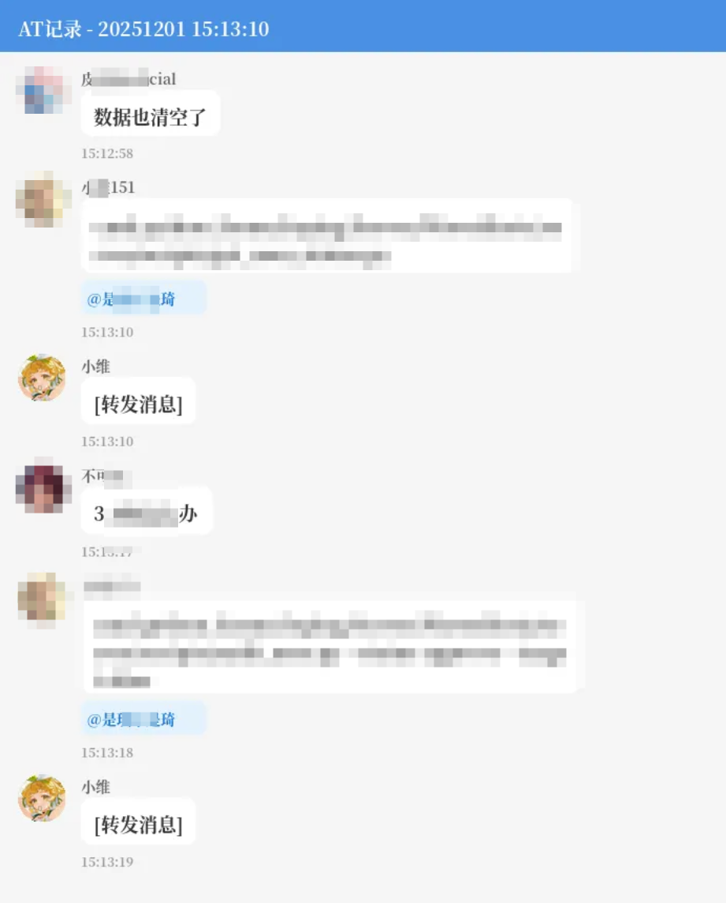

# AT_Tracker T_T插件

！会cache at过程中的聊天图片！注意检查储存占用！

谁at我，图文版本。Nonebot版本也放在同目录下。都使用Nonebot了，想必会用。

基于我本地的nb插件改的。逻辑大概是，每个a at b对应一张图，a 连续at b算同一张，期间c at b算另一个记录。然后记录范围是 -5~+10条消息的 a最初发言-1条到最后发言的+1条。我认为谁at我本该如此，而不是展示无意义的单条消息。

好久了，有些东西也有点忘了，非严重bug不管。

移植的时候留个名字。

Done in 5 min.

